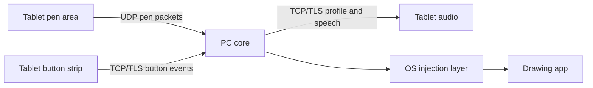
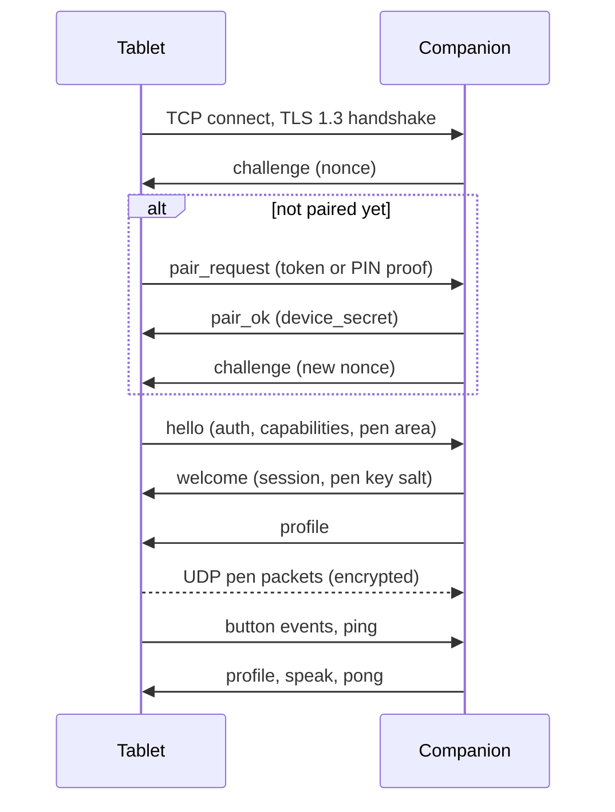

# Chiz v1 Specification

Sep 24, 2026 · @Eren Ekşi

## 1. Overview and scope

Chiz v1 turns an Android tablet into a screenless pen tablet for a Windows or Linux PC. The pen moves the PC cursor with pressure, tilt and hover, and touch buttons on the tablet fire keyboard shortcuts with spoken feedback. Everything runs over the local network.

Chiz is free, ad-free and payment-free. The name comes from the Turkish word "Çiz" ("draw"); "Chiz" is the ASCII spelling used for package names, domains and repositories.

This spec is normative where it says MUST, SHOULD or MAY (RFC 2119 meaning). Technology suggestions are not normative. A builder who has never heard of Chiz should be able to build both apps from this document alone.

### What v1 delivers

- Pairing a tablet with a PC by QR code or PIN.
- Pen input (position, pressure, tilt, hover, eraser end, barrel buttons) injected into the OS as a real pen device.
- A button strip with per-app profiles, keyboard-shortcut actions and audio-first feedback.
- Mapping the pen area to a chosen monitor region, with aspect lock, rotation and a pressure curve.
- Windows 10 (1809 or later), Windows 11, and Linux on X11 and Wayland.

### Not in v1 (do not build)

- Screen streaming (planned for v1.1).
- macOS, USB transport, Bluetooth, relay service, cloud accounts.
- Finger gestures on the pen area; fingers only operate buttons.
- WinTab driver support and more than one tablet at a time.

### Rules that override convenience

1. Pen data never waits on anything else: it has its own socket and its own thread on both sides.
2. No feature may depend on device haptics; feedback is audio plus screen.
3. The tablet is a thin client. Layouts, actions, mapping and pressure curves live on the PC.
4. Prefer the simple option. v1.1 features are reserved in the protocol, not built.

v1 is done when every acceptance test in section 13 passes.

## 2. Architecture and terminology

Chiz is two programs, the tablet app and the PC companion, joined by one TCP control connection and one UDP pen stream.



Pen packets and button events travel on separate connections, so a slow control message can never delay a pen point.

### Terminology

| Term | Meaning |
| --- | --- |
| Tablet app | The Android app the artist holds. |
| Companion | The PC program that receives input and injects it into the OS. |
| Pen area | The part of the tablet screen where pen input counts. |
| Button strip | A strip along one screen edge holding the virtual buttons. Fingers only. |
| Profile | A named button layout plus actions, stored on the PC, optionally tied to an app. |
| Session | One authenticated connection between one tablet and the companion. |
| Control channel | TCP + TLS connection carrying JSON messages. |
| Pen channel | UDP stream of encrypted pen packets, tablet to PC only. |
| Active area | The monitor region the pen area maps onto. |
| Earcon | A very short non-speech sound used as feedback. |

### Who owns what

| Concern | Owner |
| --- | --- |
| Profiles, button actions, shortcuts | PC |
| Button labels and spoken text | Defined on the PC, sent to the tablet, spoken on the tablet |
| Monitor choice, active area, pressure curve | PC |
| Rotation, strip edge and size, palm rejection, audio settings, screen dimming | Tablet (local settings) |
| Pairing records | Both sides |

### Recommended stack

Any stack that follows this spec is acceptable. These choices are known to fit.

| Part | Recommendation |
| --- | --- |
| Tablet app | Kotlin; minSdk 29 (Android 10, for TLS 1.3); Jetpack Compose for screens; a custom View for the pen area; SoundPool; TextToSpeech; NsdManager; ZXing for QR scanning |
| Companion | Rust; tokio and rustls; RustCrypto (aes-gcm, hkdf, hmac, sha2); mdns-sd; the windows crate; evdev/uinput bindings; egui; tray-icon; qrcode |

### Threading rules

- Tablet: the UI thread captures pen samples and hands them to a sender thread that batches and sends UDP. Control runs on its own coroutine or thread.
- Companion: one UDP receive thread feeds one injection thread. Control runs on the async runtime.
- Nothing on the pen path may block on UI, disk, DNS or the control channel.

## 3. Wire protocol, part 1: transport, discovery and pairing

The tablet finds the PC with mDNS, connects over TLS 1.3, proves who it is, and only then sends pen data over UDP. This section covers everything up to the first control message; section 4 covers the messages.

### Conventions

- Binary integers are little-endian. Strings are UTF-8. Base64 is the standard alphabet with padding, unless a field says base64url.
- Control messages are JSON (RFC 8259). The protocol version is the integer 1.
- Receivers MUST ignore unknown JSON fields and unknown message types.
- A fingerprint is the SHA-256 hash of a DER-encoded certificate (32 bytes).

### Transports

| Purpose | Transport | Default port | Listener |
| --- | --- | --- | --- |
| Control | TCP with TLS 1.3 | 47800 | Companion |
| Pen | UDP | 47801 | Companion |
| Discovery | mDNS / DNS-SD, service `_chiz._tcp.local.` | 47800 | Companion advertises, tablet browses |

The companion MUST bind IPv4 on all interfaces and MAY also bind IPv6. Ports are configurable on the PC; the tablet learns the pen port from the `welcome` message. The mDNS TXT record carries `v=1`, `id` (first 8 hex characters of the certificate fingerprint) and `name` (PC hostname, at most 32 characters).

The tablet MUST also offer manual entry of an IP address and port, because guest Wi-Fi and client isolation break mDNS.

### TLS

- TLS 1.3 only. The companion creates a self-signed ECDSA P-256 certificate on first run (SHA-256 signature, 10 years, subject CN `chiz-<hostname>`) and stores the key where only the current user can read it.
- The tablet MUST NOT use the system trust store. After pairing it accepts only a certificate whose fingerprint equals the stored one.
- The tablet presents no client certificate. It authenticates inside TLS with its device secret (section 4).

### Pairing

Pairing happens once per tablet and PC. The user starts it on the PC with a "Pair new tablet" button.

1. The companion opens a pairing window for 120 seconds and creates a pair token (16 random bytes) and a PIN (8 random decimal digits, leading zeros allowed).
2. The PC shows a QR code, the PIN and its addresses. Only one window can be open at a time.
3. The window closes on success, on timeout, or after 5 failed attempts. Outside a window, unpaired tablets get `error` with code `not_paired`.

Two modes exist. QR mode is preferred.

|  | QR mode | PIN mode |
| --- | --- | --- |
| User action | Scan the QR code shown on the PC | Pick the PC in the list (or type its address), then type the PIN |
| Tablet learns the PC fingerprint | From the QR code, before connecting | From the TLS handshake, while connecting |
| Proof sent in `pair_request` | The pair token | An HMAC proof (formula below) |

QR content is the URI `chiz://pair?v=1&h=<hosts>&p=<port>&fp=<fingerprint, base64url>&t=<token, base64url>`. The `h` value is a comma-separated list of IPv4 addresses; the tablet tries each for 2 seconds, in order.

PIN proof: `proof = base64( HMAC-SHA256( key = ASCII(PIN), msg = "chiz-pair-v1" || fp_seen || nonce || UTF8(device_id) ) )`. Here `fp_seen` is the 32-byte fingerprint the tablet observed in TLS, `nonce` is the 16 bytes from the companion's `challenge`, and `||` is concatenation. The companion recomputes it with its own fingerprint and compares in constant time. A man in the middle presents a different certificate, so the proof fails.

On success the companion creates `device_secret` (32 random bytes), stores it with the tablet's `device_id` and name, and returns it in `pair_ok`. The tablet stores the PC fingerprint, the secret and recent addresses, encrypted with an Android Keystore key.

Known limitation of PIN mode: an attacker who is actively on the LAN and captures one proof can guess an 8-digit PIN offline before the window closes. The PC UI MUST say "Prefer QR pairing. Use PIN pairing only on a network you trust." v1.1 replaces this with SPAKE2.

Revoking: the PC lists paired tablets with a "Forget" button. Forgetting deletes the secret and closes any live session with `error` code `not_paired`. The tablet has "Forget this PC", which deletes its record.

### Connection sequence



### Reconnection

While the tablet service runs and a PC is selected, a dropped control connection MUST trigger reconnect attempts after 0.5, 1, 2 and 4 seconds, then every 5 seconds. Each attempt tries the mDNS address first, then the stored addresses.

## 4. Wire protocol, part 2: control messages

The control channel carries small JSON messages for handshake, buttons, profiles and liveness. Pen data never uses it.

### Framing and timing

- Each message is a `u32` byte length followed by that many bytes of UTF-8 JSON. The length MUST NOT exceed 65,536.
- Every message is a JSON object with a string field `t` naming its type.
- The companion MUST close a connection that has not reached `welcome` within 10 seconds of TCP accept.
- The tablet sends `ping` once per second. Either side MUST treat 5 seconds without any incoming message as a dead connection and close it.

### Handshake messages

| Type | From | Fields | Meaning |
| --- | --- | --- | --- |
| `challenge` | PC | `proto` (1), `nonce` (base64, 16 random bytes), `pc_name`, `os` (`windows` or `linux`), `pairing_open` (bool) | First message after TLS. Starts authentication. |
| `hello` | Tablet | `proto`, `device_id` (UUID v4), `device_name`, `app_version`, `auth`, `caps`, `pen_area` | Authenticates a paired tablet. |
| `welcome` | PC | `session_id` (u32), `pen_port`, `pen_key_salt` (base64, 16 bytes), `features` | Accepts the session. The companion sends `profile` right after. |
| `error` | Either | `code`, `message` | The sender closes the connection after sending. |
| `bye` | Either | none | Clean close. |

`auth` = base64( HMAC-SHA256( key = device\_secret, msg = "chiz-auth-v1" || nonce || UTF8(device\_id) ) ), where `nonce` is the 16 raw bytes from the latest `challenge`.

`caps` describes tablet hardware: `{"pressure": true, "tilt": true, "hover": true, "eraser": true, "barrel": 2, "video": false}`. The companion disables features the tablet lacks. `video` MUST be `false` in v1.

`pen_area` is `{"w": 2100, "h": 1600}`: the pen area size in pixels in its current orientation. The companion uses only its ratio.

`features` is `{"video": false}` in v1. It reserves room for v1.1 streaming.

Error codes: `bad_proto` (adds `supported`, a list of ints), `not_paired`, `auth_failed`, `busy`, `bad_message`, `internal`.

### Pairing messages

| Type | From | Fields | Meaning |
| --- | --- | --- | --- |
| `pair_request` | Tablet | `proto`, `device_id`, `device_name`, `mode` (`qr` or `pin`), `token` (base64, QR mode) or `proof` (base64, PIN mode) | Asks to pair. Sent instead of `hello` while unpaired. |
| `pair_ok` | PC | `device_secret` (base64, 32 bytes) | Pairing succeeded. The PC then sends a fresh `challenge`. |
| `pair_fail` | PC | `code` (`bad_token`, `bad_pin`, `closed`, `locked`), `attempts_left` | Pairing failed. The connection stays open until the window closes. |

### Runtime messages

| Type | From | Fields | Meaning |
| --- | --- | --- | --- |
| `ping` | Tablet | `id` (int) | Liveness and round-trip time. |
| `pong` | PC | `id` | Echoes the `ping` id. |
| `surface` | Tablet | `w`, `h` | The pen area size changed (rotation, strip resize). |
| `button` | Tablet | `id` (string), `phase` (`down` or `up`) | A virtual button was activated or released (rules in section 7). |
| `button_state` | PC | `id`, `on` (bool) | New state of a toggle button. The tablet updates its look and speaks it. |
| `profile` | PC | `profile` (object, section 11), `reason` (`connect`, `app`, `manual`), `app` (string or null) | Replaces the whole button layout. |
| `speak` | PC | `text`, `interrupt` (bool) | Asks the tablet to speak a short text. |

Examples:

```json
{"t":"hello","proto":1,"device_id":"5b0f6c1e-7d0a-4a55-9d3e-0c6f1a2b3c4d","device_name":"Galaxy Tab S9","app_version":"1.0.0","auth":"...base64...","caps":{"pressure":true,"tilt":true,"hover":true,"eraser":true,"barrel":2,"video":false},"pen_area":{"w":2100,"h":1600}}
{"t":"welcome","session_id":1093482,"pen_port":47801,"pen_key_salt":"...base64...","features":{"video":false}}
{"t":"button","id":"undo","phase":"down"}
```

### Session rules

- One tablet at a time. A second authenticated tablet gets `error` with code `busy`. The same `device_id` reconnecting replaces its old session.
- Unknown `button` ids are ignored.
- When a session ends for any reason, the companion MUST release every held key, lift any pen contact, leave pen range, and drop later pen datagrams for that `session_id`.
- The companion sends `profile` after `welcome`, and again whenever the active profile changes.

## 5. Wire protocol, part 3: pen packets

Pen samples travel from tablet to PC as encrypted UDP datagrams, each holding 0 to 16 fixed-size records. Nothing is sent back on this channel.

### Datagram layout

| Offset | Size | Field | Notes |
| --- | --- | --- | --- |
| 0 | 1 | magic | `0xC1`: high nibble C for Chiz, low nibble is protocol version 1. Drop anything else. |
| 1 | 1 | reserved | 0 |
| 2 | 4 | session\_id | u32 from `welcome` |
| 6 | 4 | seq | u32. Starts at 1, increases by 1 per datagram. |
| 10 | N | ciphertext | AES-256-GCM encryption of the plaintext below |
| 10+N | 16 | tag | GCM authentication tag |

### Encryption

- Key: `pen_key = HKDF-SHA256(ikm = device_secret, salt = pen_key_salt, info = ASCII "chiz-pen-v1", length = 32)`. The salt comes from `welcome`, so every session has a fresh key.
- Cipher: AES-256-GCM with a 12-byte nonce made of `seq` as u32 little-endian followed by 8 zero bytes.
- Additional authenticated data: the first 10 bytes of the datagram (magic through seq).
- A datagram that fails authentication MUST be dropped silently.
- The tablet MUST end the session and reconnect before `seq` reaches `0xFFFF0000`.

### Plaintext

The plaintext is one byte `count` (0 to 16) followed by `count` records of 16 bytes. A `count` of 0 is a heartbeat.

| Offset | Size | Field | Encoding |
| --- | --- | --- | --- |
| 0 | 1 | flags | Bits 0-2 phase, bit 3 eraser end, bit 4 barrel button 1, bit 5 barrel button 2, bits 6-7 zero |
| 1 | 1 | reserved | 0 |
| 2 | 2 | x | u16. 0 is the left edge of the pen area, 65535 the right edge. |
| 4 | 2 | y | u16. 0 is the top edge, 65535 the bottom edge. |
| 6 | 2 | pressure | u16. 0 to 65535 means 0.0 to 1.0. |
| 8 | 1 | tilt\_x | i8 degrees, -90 to 90. Positive means the pen leans right. |
| 9 | 1 | tilt\_y | i8 degrees. Positive means the pen leans toward the bottom of the pen area. |
| 10 | 2 | distance | u16. Hover height, 0 to 65535 means 0.0 to 1.0. |
| 12 | 4 | t\_ms | u32 milliseconds since session start on the tablet's monotonic clock |

Phase values:

| Value | Name | Meaning |
| --- | --- | --- |
| 0 | hover | Pen in range, not touching |
| 1 | down | Tip touches the surface |
| 2 | move | Touching and moving |
| 3 | up | Tip lifts, pen still in range |
| 4 | leave | Pen leaves range |
| 5 | cancel | Android cancelled the contact. Treat as up, then leave. |

### Filling records on Android

All coordinates are relative to the pen area view in its current orientation.

| Field | Source |
| --- | --- |
| x, y | `getX/getY` (and `getHistoricalX/Y`) divided by the view width and height, clamped to 0..1 |
| pressure | `getPressure`, clamped to 0..1 |
| tilt\_x, tilt\_y | From `AXIS_TILT` (radians from vertical, clamp to 89 degrees) and `AXIS_ORIENTATION` (radians, 0 = pointing up the screen, positive clockwise): `tilt_x = round(deg(atan(tan(tilt) * sin(orient))))`, `tilt_y = round(deg(-atan(tan(tilt) * cos(orient))))` |
| distance | `AXIS_DISTANCE`, clamped to 0..1 |
| eraser | `getToolType == TOOL_TYPE_ERASER` |
| barrel buttons | `getButtonState` bits `BUTTON_STYLUS_PRIMARY` and `BUTTON_STYLUS_SECONDARY` |
| t\_ms | The sample's event time minus the session start, on the `uptimeMillis` clock |
| phase | `ACTION_DOWN` gives down; `ACTION_MOVE` while touching gives move; `ACTION_UP` gives up; `ACTION_HOVER_ENTER` and `ACTION_HOVER_MOVE` give hover; `ACTION_HOVER_EXIT` gives leave; `ACTION_CANCEL` gives cancel |

Android's tilt sign conventions differ between devices. Keep the conversion in one function so one sign flip fixes it, and verify it with the acceptance test in section 13.

### Sender rules (tablet)

1. Send one datagram per `MotionEvent`, holding every historical sample plus the current one, oldest first. If that is more than 16 records, split into several datagrams in order.
2. Call `requestUnbufferedDispatch` on the pen area for pen events.
3. While a pen is in range, send at least one datagram every 250 ms (a heartbeat if idle).
4. Repeat every down, up, leave and cancel record twice more, in datagrams sent about 10 ms and 20 ms later. This covers UDP loss without retransmission logic.
5. Never retransmit move or hover samples. The newest data wins.
6. A contact that starts outside the pen area is ignored. A contact that starts inside continues to report clamped coordinates until the pen lifts.

### Receiver rules (companion)

1. Drop a datagram if the magic, session\_id or tag is wrong, if its source IP differs from the control connection's peer IP, or if `seq` is not higher than the highest accepted `seq`.
2. Apply records in order. Keep `last_t_ms`. Drop a record if its `t_ms` is lower than `last_t_ms`, or if its 16 bytes are identical to the previously applied record. This removes the repeats from sender rule 4.
3. Watchdog: if the pen is down and no datagram arrives for 750 ms, inject up then leave. If the pen is hovering and none arrives for 1000 ms, inject leave.
4. Log and count dropped datagrams; show the counters on the companion's status screen.

### Test vectors

Use these to check both implementations. All values are exact.

```text
device_secret   = 000102030405060708090a0b0c0d0e0f101112131415161718191a1b1c1d1e1f
pen_key_salt    = a0a1a2a3a4a5a6a7a8a9aaabacadaeaf
session_id      = 1093482 (0x0010AF6A), seq = 1
pen_key         = 0fcc4ff1babc2af33fbfa107f14f14632e88eafcc4624d87f11072ca74e777d9
record          = phase down, pen tip, x 0x8000, y 0x4000, pressure 0x2000,
                  tilt_x 15, tilt_y -10, distance 0, t_ms 1234
plaintext       = 0101000080004000200ff60000d2040000
nonce           = 010000000000000000000000
AAD (header)    = c1006aaf100001000000
datagram (43 B) = c1006aaf1000010000008042b5e368236419bdc1a62d3f80e2e3c0b136f1c90ea1278848a0bff1f7232524
```

Control-channel proofs from section 3 and 4, using the same `device_secret`, a `nonce` of the bytes `00` to `0f`, and `device_id` `5b0f6c1e-7d0a-4a55-9d3e-0c6f1a2b3c4d`:

```text
nonce (base64)  = AAECAwQFBgcICQoLDA0ODw==
auth (base64)   = DdLGZwJqsXzvI3MQKJX9vL5d9LJnGT4eYPCx6kTgps8=

PIN proof with pin "12345678" and fp_seen = bytes 20 to 3f:
proof (base64)  = XDbvfPmZHgCAs32kb3NRxh11K7eINs+TazjCRsV116Y=
```

## 6. Tablet app (Android)

The tablet app captures pen samples, shows and speaks the button strip, and keeps the connection alive. It holds no drawing logic and no shortcuts; those live on the PC.

### Platform and permissions

Kotlin, minSdk 29 (Android 10), targetSdk the latest stable release. The app works on any Android device with a touchscreen; a stylus is needed for the pen area.

| Permission | Why |
| --- | --- |
| `INTERNET`, `ACCESS_NETWORK_STATE` | Sockets and network state |
| `CHANGE_WIFI_MULTICAST_STATE` | mDNS discovery; also qualifies the service for the connected-device type |
| `WAKE_LOCK` | Wi-Fi lock and partial wake lock while connected |
| `FOREGROUND_SERVICE`, `FOREGROUND_SERVICE_CONNECTED_DEVICE` | Keep the connection alive |
| `POST_NOTIFICATIONS` | The foreground service notification on Android 13+ |
| `CAMERA` | QR pairing only. Ask when the user taps "Scan QR", never at launch. |

Newer Android versions are adding a local-network permission. Check the current Android documentation for your target version and request it when required.

### Screens

| Screen | Purpose |
| --- | --- |
| Connect | Lists paired PCs with status (found or not found) and buttons Connect and Forget. Has "Pair new PC" with Scan QR, PIN entry, and manual address entry. |
| Drawing | The main screen: a button strip along one edge and the pen area filling the rest. Immersive full screen. |
| Settings | Local settings (table below). |
| Test | Pen area with a live readout of x, y, pressure, tilt, distance, tool and buttons, plus a local ink trail drawn with a plain Canvas. Sends nothing to the PC. |

On first launch show a three-step introduction: what the app does, how the strip speaks, how to pair.

### Drawing screen rules

- The strip has a 56 dp header holding a connection dot and a Menu hold-button. Holding Menu for 1 second opens a sheet with Settings, Test and Disconnect. Profile buttons fill the rest of the strip.
- The connection dot is green when connected, amber when reconnecting, red when disconnected. State changes are also spoken ("Connected to Studio PC", "Disconnected").
- The system Back action speaks "Press back again to disconnect" and needs a second press within 2 seconds.
- Hide system bars and register system-gesture exclusion rects over the pen area so edge swipes do not leave the app.
- Keep the screen on while connected. If "Dim screen" is on, drop brightness to 5 percent after 30 seconds without input. Only a finger touch on the strip restores it; pen input does not.
- If "Button guard" is on, buttons are disabled while the pen is touching the pen area, so a resting palm cannot fire them.
- If TalkBack is on, show a one-time notice that it should be off while drawing. Direct-touch support for TalkBack is not part of v1.

### Pen area view

- A custom `View` that handles `onTouchEvent` and `onGenericMotionEvent` (hover) itself.
- Only events whose tool type is stylus or eraser enter the pen pipeline. Finger and palm events are consumed and ignored, including `ACTION_CANCEL` with the canceled flag.
- Track only the first stylus pointer. Ignore additional pointers.
- Build records as described in section 5 and hand them to the sender queue. Never touch the network on the UI thread.

### Connection service

A foreground service of type `connectedDevice` owns the control socket, the pen sender and the audio engine, so rotating the screen does not drop the session. The activity binds to it.

- Holds a Wi-Fi lock (`WIFI_MODE_FULL_LOW_LATENCY` where available, else `WIFI_MODE_FULL_HIGH_PERF`) and a partial wake lock while connected.
- Shows an ongoing low-importance notification "Connected to \<PC>" with a Disconnect action.
- Control socket: `SSLSocket` set to TLS 1.3 only, a custom trust manager that enforces the pinned fingerprint (or captures it in PIN mode), `TCP_NODELAY` on, its own reader thread.
- Pen socket: a `DatagramSocket` connected to the PC address and pen port, fed by a dedicated sender thread and a bounded queue. If the queue is full, drop the oldest move or hover record.
- Time base for `t_ms`: `SystemClock.uptimeMillis()`.
- Mute check: on connect and every 30 seconds, if the media volume is 0 show "Volume is muted: button feedback will not be heard."
- On start, warm up text-to-speech and preload all earcons (section 7).

### Local settings

| Setting | Options | Default |
| --- | --- | --- |
| Strip edge | Left, right, top, bottom | Left |
| Strip size | 10 to 35 percent of the shorter screen side | 16 percent |
| Orientation | Auto, landscape, landscape flipped, portrait, portrait flipped | Landscape |
| Button guard | On or off | On |
| Dim screen | On or off | On |
| Feedback mode | Speech and earcons, earcons only, speech only, off | Speech and earcons |
| Speech rate | 0.5x to 4.0x | 2.0x |
| Feedback volume | 0 to 100 percent | 70 percent |
| Announce mode | Rest to announce, touch to announce (section 7) | Rest to announce |
| Rest delay | 150 to 600 ms | 250 ms |
| Show button labels | On or off | On |

Changing the strip edge, strip size or orientation changes the pen area size, so the tablet MUST send a `surface` message afterward.

## 7. Virtual buttons and audio feedback

Buttons are found by touch and heard, not seen: a finger resting on a button speaks its name, and a quick tap fires it with just a click. The artist's eyes stay on the monitor, and no feedback depends on device haptics.

### Button kinds

| Kind | Behavior |
| --- | --- |
| `tap` | Fires its action once per activation. |
| `hold` | Presses its keys on activation and releases them when the finger lifts. For modifiers, such as holding Space to pan. |
| `toggle` | Flips between on and off on each activation. The PC owns the state and reports it in `button_state`. |

### Touch model

The tablet decides when a button activates and sends `button` with phase `down`; for `tap` and `toggle` it sends phase `up` immediately after. For `hold` it sends `up` when the finger lifts. The PC runs the action on `down`. Buttons respond to fingers only, never to the pen.

The Announce mode setting selects between two models. Rest delay defaults to 250 ms.

| Situation | Rest to announce (default) | Touch to announce |
| --- | --- | --- |
| Finger lands on a button | Silent. Start the rest timer. | Speak the label at once, interrupting earlier speech. |
| Finger lifts before the rest delay | Activate (`tap`, `toggle`) with the fire earcon. No speech. | Activate on lift with the fire earcon. |
| Finger still on the button when the rest delay ends | Speak the label. Lifting afterward does NOT activate. For `hold`, also activate now. | Nothing new. Lifting activates. For `hold`, activate now. |
| Finger slides onto a button from another one | Speak the label at once. Lifting does NOT activate. | Speak the label at once. Lifting activates. |
| Finger slides off all buttons and lifts | Nothing fires. | Nothing fires. |

Additional rules:

- Track up to 3 fingers on the strip at once, so one finger can hold a modifier while another taps.
- Each new announcement stops any speech still playing.
- With Button guard on, a touch on a button while the pen is touching the pen area does nothing except play the blocked earcon.
- A `hold` button that is still held when the session ends or the profile changes is released first.

A `hold` button never activates on a quick tap. In both announce modes it activates when the rest delay ends and releases when the finger lifts.

### Feedback events

| Event | Earcon | Speech |
| --- | --- | --- |
| Tap or toggle activated | `fire` | None. Toggles then speak their new state, for example "Eraser on", when speech is enabled. |
| Toggle state arrives in `button_state` | `on` (rising) or `off` (falling) | "\<label> on" or "\<label> off" |
| Hold engaged or released | `hold_on`, `hold_off` | None |
| Button touched, announcement due | None | The button's `speak` text, or its label if `speak` is empty |
| Blocked by Button guard | `blocked` | None |
| Profile changes because of `reason` `app` or `manual` | None | The profile name, for example "Krita" |
| Connected, disconnected | `connect`, `disconnect` | "Connected to \<PC name>", "Disconnected" |
| Message from PC (`speak`) | None | The given text |

Feedback mode filters this table: "earcons only" drops the speech column, "speech only" drops the earcon column, "off" drops both.

### Earcons

Eight short sounds shipped as 16-bit, 44.1 kHz mono WAV files in `res/raw`, peak level -6 dBFS, none longer than 200 ms.

| Name | Character | Length |
| --- | --- | --- |
| `fire` | Dry click near 1.2 kHz | 40 ms |
| `hold_on`, `hold_off` | Click near 1.6 kHz, click near 0.9 kHz | 50 ms |
| `on`, `off` | Two notes rising 600 to 900 Hz, two notes falling 900 to 600 Hz | 90 ms |
| `blocked` | Low thud near 200 Hz | 60 ms |
| `connect`, `disconnect` | Three notes rising, three notes falling | 200 ms |

Load all earcons into one `SoundPool` (max 4 streams) at service start. Play them with audio attributes usage `USAGE_GAME` and content type `CONTENT_TYPE_SONIFICATION`, which follows the media volume. Do not use the accessibility usage: it typically maps to a separate volume stream that non-TalkBack users cannot easily adjust.

### Speech

- Create one `TextToSpeech` instance in the service at start and warm it with a short silent utterance. Never create it per utterance.
- Apply the user's speech rate with `setSpeechRate`, the same audio attributes but content type `CONTENT_TYPE_SPEECH`, and the feedback volume as the utterance volume parameter.
- Always use `QUEUE_FLUSH`.
- Keep labels and `speak` text to three words or fewer. Long text delays the moment the artist knows what the button does.

#### Speech cache for low latency

Live text-to-speech latency varies a lot between devices, so button speech is cached as audio.

1. When a `profile` arrives, synthesize each button's `speak` text (and toggle on/off phrases) to WAV files in the app cache with `synthesizeToFile`.
2. Key each file by a hash of text, TTS engine, locale and speech rate. A rate change re-synthesizes.
3. Play cached files through `SoundPool` (or a preloaded `AudioTrack`). Until a file exists, fall back to live speech.
4. Keep the cache under 20 MB, deleting the least recently used files first.

### Latency target

From touch-down (`MotionEvent` time) to the audio call, the app SHOULD spend under 40 ms at the 95th percentile. Log both timestamps in a debug build so this can be measured. Output-device latency is outside the app's control.

### Layout rules

- The strip is a grid of `cols` (1 to 3) by `rows` (1 to 12) cells below the header. A button covers `col`, `row`, `colspan`, `rowspan`.
- Every cell is fully touchable. Visible gaps between buttons are cosmetic; the hit area fills the cell.
- Cells should be at least 56 dp on their short side. The PC's profile editor warns when a layout cannot meet this at the default strip size.
- Draw labels at 16 sp or larger with strong contrast, and fill toggle buttons when on. Users can hide labels in settings.
- Put frequent buttons on the strip edge nearest the pen hand. Row 0, column 0 is the natural "home" position; the spec does not enforce this.

## 8. PC companion: core

The companion turns pen packets into operating-system pen events and button events into shortcuts, applying the user's mapping and pressure curve. The core below is identical on Windows and Linux; only the platform layer (sections 9 and 10) differs.

### Responsibilities

- Run in the background with a tray icon. Open a main window on demand.
- Listen on TCP 47800 and UDP 47801, and advertise `_chiz._tcp` over mDNS.
- Handle pairing, sessions, profiles, mapping, pressure curves, injection and status.
- Optionally start at login (off by default).

### Platform interface

The core talks to the OS only through this interface. Everything else is shared code.

```text
Monitor    { id, name, x, y, w, h, primary }      // physical pixels, virtual-desktop coordinates
PenEvent   { phase, x_px, y_px, pressure (0..1), tilt_x, tilt_y (degrees),
             distance (0..1), eraser, barrel1, barrel2 }

monitors()            -> list of Monitor
inject_pen(PenEvent)
inject_key(key, down)                             // key names from the table in section 11
inject_mouse(button, down)                        // left, right, middle at the current pointer
foreground_app()      -> optional string          // exe name on Windows, WM_CLASS on Linux/X11
release_all()                                     // lift pen, leave range, release every key and button
```

### Pen pipeline

For each accepted record (section 5), in this order:

1. Rotate and map (x, y) to a pixel position (next subsection).
2. Run pressure through the curve.
3. If the eraser toggle is on, set `eraser` to true.
4. Copy phase, tilt, distance and barrel bits unchanged.
5. Call `inject_pen`.

The companion SHOULD add under 2 ms between a datagram arriving and the OS call. Log both timestamps in debug builds.

### State repair

UDP can lose records, so the companion tracks `in_range` and `in_contact` and repairs the sequence before each `inject_pen` call. Both platform layers use these rules.

- `down` or `move` while not in range: inject a hover at the same position first.
- `move` while not in contact: inject `down` first.
- `hover` while in contact: inject `up` first.
- `up` while not in contact, or `leave` while not in range: ignore.
- Switching between the pen and eraser ends is only allowed out of contact. If contact is active, inject `up` and `leave` first.

### Mapping

Settings, saved per companion: `monitor` (a monitor id, or `all` for the whole virtual desktop), `area` (a rectangle `{x, y, w, h}` in 0..1 within that monitor, default the whole monitor), `keep_aspect` (default true) and `rotation` (0, 90, 180 or 270, default 0).

Rotation turns the pen area clockwise relative to the monitor. With input `(x, y)` in 0..1:

```text
rotation   u        v
0          x        y
90         1 - y    x
180        1 - x    1 - y
270        y        1 - x
```

With `keep_aspect`, the used part of the pen area is the largest centered rectangle with the same aspect ratio as the active area, so circles stay circles. Let `rp` be the pen area ratio (width over height, inverted when rotation is 90 or 270) and `ra` the active area's pixel ratio.

```text
if rp > ra:  fw = ra / rp;  u = clamp((u - (1 - fw) / 2) / fw, 0, 1)
if rp < ra:  fh = rp / ra;  v = clamp((v - (1 - fh) / 2) / fh, 0, 1)
x_px = area_left + u * (area_w_px - 1)
y_px = area_top  + v * (area_h_px - 1)
```

Positions outside the used part clamp to the edge of the active area. The pen area size and ratio come from `pen_area` in `hello` and from later `surface` messages.

### Pressure curve

The curve is a cubic Bezier from (0, 0) to (1, 1) with control points `(x1, y1)` and `(x2, y2)`, stored as `[x1, y1, x2, y2]` with x values in 0..1. To map an input pressure `p`, solve `x(t) = p` for `t` (bisection, 12 iterations) and return `y(t)`. Presets, which are starting points:

| Preset | Curve |
| --- | --- |
| Linear (default) | `[0.25, 0.25, 0.75, 0.75]` |
| Soft | `[0.10, 0.40, 0.50, 0.90]` |
| Firm | `[0.50, 0.10, 0.90, 0.50]` |

### Profiles and actions

Profiles, buttons and actions use the JSON in section 11.

- Profile selection: poll `foreground_app()` every 500 ms. After a change is stable for 300 ms, pick the first profile whose `apps` list contains the app (case-insensitive), otherwise the profile marked `default`. If it differs from the current one, send `profile` with reason `app`.
- A manual choice in the UI or a `profile` action locks that profile until the user picks Auto.
- Action types:

| Type | Fields | Behavior |
| --- | --- | --- |
| `key` | `keys`, optional `keys_off` | Press a combination such as `ctrl+shift+z`: modifiers down in order, key down, key up, modifiers up in reverse, about 2 ms apart. For `hold` buttons, keys stay down until `up`. For `toggle` buttons, `keys` runs when turning on and `keys_off` (if present, else `keys`) when turning off. |
| `macro` | `steps` (at most 20) | Runs steps in order on a worker thread. A step is `{"keys": "..."}` or `{"wait_ms": n}` with n up to 2000. Not allowed on `hold` buttons. |
| `profile` | `target`: a profile id, `next`, `prev` or `auto` | Switches profile and locks it (except `auto`). |
| `eraser_toggle` | none | Forces the eraser flag on every pen event while on. Only valid on `toggle` buttons. |
| `mouse` | `button`: `left`, `right` or `middle` | Clicks at the current pointer. On `hold` buttons, holds the button. |
| `none` | none | Does nothing. |

- The companion tracks every key and mouse button it holds and releases them all through `release_all` when the session ends, the profile changes, or the app quits.

### Companion UI

| Area | Contents |
| --- | --- |
| Tray | Status color; menu with Open, Pair new tablet, Profile (Auto and the list), Pause pen input, Quit |
| Status | Tablet name, round-trip time, dropped-packet counters, live pen values (x, y, pressure, tilt, distance, tool, buttons) |
| Mapping | Monitor picker, area editor (numbers and a drag box), keep-aspect and rotation controls, a test box that shows where the cursor lands |
| Pressure | Curve editor, presets, live pressure meter |
| Profiles | Profile list and editor (below) |
| Tablets | Paired tablets with Forget; Pair new tablet showing the QR code, PIN and 120-second countdown |
| Settings | Ports, start at login, log level |

Profile editor: name, apps (comma-separated), default flag, grid size, and a table of buttons with label, spoken text, kind, position and size, and an action editor. It MUST validate unique ids, valid key strings, no overlapping buttons and at most one `default` profile.

When Pause pen input is on, the companion drops decoded pen records and injects `leave` once. Buttons keep working.

### Failure handling

If pen injection fails (device creation error, missing permission), show a banner with the platform-specific fix from section 9 or 10, keep the control connection open, and retry device creation every 5 seconds.

## 9. PC companion: Windows

On Windows the companion presents itself as a real pen through the synthetic pointer API, so Windows Ink applications see pressure, tilt, hover and the eraser end. It targets Windows 10 version 1809 (build 17763) or later, and Windows 11.

### Build requirements

- Application manifest: `dpiAwareness` per-monitor v2, so monitor sizes and injected coordinates are physical pixels. Execution level `asInvoker`.
- 64-bit x86-64 builds are required. ARM64 builds are optional.

### Pen injection

Create one device on first use with `CreateSyntheticPointerDevice(PT_PEN, 1, POINTER_FEEDBACK_NONE)`. Keep it for the life of the process and recreate it after any injection failure. Inject each `PenEvent` with `InjectSyntheticPointerInput` using one `POINTER_TYPE_INFO` whose `type` is `PT_PEN`. The system cursor still follows the pen.

Zero-initialize the structures, then fill `POINTER_PEN_INFO` as follows.

| Field | Value |
| --- | --- |
| `pointerInfo.pointerType` | `PT_PEN` |
| `pointerInfo.pointerId` | 0 |
| `pointerInfo.ptPixelLocation` | `(x_px, y_px)` in virtual-desktop physical pixels. Negative values are valid. |
| `pointerInfo.pointerFlags` | From the phase table below |
| `penMask` | `PEN_MASK_PRESSURE \| PEN_MASK_TILT_X \| PEN_MASK_TILT_Y` |
| `pressure` | `round(pressure * 1024)`, range 0 to 1024 |
| `tiltX`, `tiltY` | Degrees, -90 to 90, copied from the record |
| `penFlags` | `PEN_FLAG_BARREL` when barrel1 is set; `PEN_FLAG_INVERTED` while the eraser end is in range; `PEN_FLAG_ERASER` while the eraser end touches |

When barrel1 is set, also add `POINTER_FLAG_SECONDBUTTON` to `pointerFlags`. Windows has no second barrel flag, so barrel2 is ignored on Windows in v1. Hover distance is not exposed by the API and is ignored.

| Phase | `pointerFlags` |
| --- | --- |
| hover | `INRANGE \| UPDATE`, plus `NEW` on the first event of an in-range period |
| down | `INRANGE \| INCONTACT \| FIRSTBUTTON \| DOWN` |
| move | `INRANGE \| INCONTACT \| FIRSTBUTTON \| UPDATE` |
| up | `INRANGE \| UP` |
| leave | `UPDATE` (no `INRANGE`) |

All flag names are `POINTER_FLAG_...`. Use the state repair rules in section 8 so the sequence sent to Windows is always valid. Confirm the leave behavior in the acceptance tests: if the pen appears stuck in range, send one more `UPDATE` without `INRANGE`.

### Monitors

Enumerate with `EnumDisplayMonitors` and `GetMonitorInfoW`. Use `rcMonitor` for position and size and `MONITORINFOF_PRIMARY` for the primary flag. Use the device name (for example `\\.\DISPLAY1`) as the id and the friendly name from `DisplayConfigGetDeviceInfo` for display. Re-enumerate on `WM_DISPLAYCHANGE` and at the start of every session.

### Keyboard and mouse

- Use `SendInput` with `INPUT_KEYBOARD`. Set `wVk` and `wScan = MapVirtualKeyW(vk, MAPVK_VK_TO_VSC)`. Add `KEYEVENTF_EXTENDEDKEY` for extended keys (arrows, Home, End, Page Up, Page Down, Insert, Delete, Windows keys). Add `KEYEVENTF_KEYUP` on release.
- Send a whole key combination in one `SendInput` call so real keyboard input cannot interleave with it.
- Use the left-side modifiers (`VK_LCONTROL`, `VK_LSHIFT`, `VK_LMENU`, `VK_LWIN`).
- Mouse clicks use `SendInput` with `MOUSEEVENTF_LEFTDOWN`, `_LEFTUP`, `_RIGHTDOWN`, `_RIGHTUP`, `_MIDDLEDOWN` and `_MIDDLEUP`.

Virtual-key codes for every key name are in section 11.

### Foreground application

Call `GetForegroundWindow`, then `GetWindowThreadProcessId`, then `OpenProcess(PROCESS_QUERY_LIMITED_INFORMATION)`, then `QueryFullProcessImageNameW`. Use the lower-cased file name, for example `krita.exe`, as the app id. Store apps hosted by `ApplicationFrameHost.exe` all look alike; v1 does not distinguish them.

### Administrator windows (UIPI)

Windows blocks injected input to windows of a higher integrity level, so an application started as administrator ignores a normal companion. On each foreground change, open the foreground process token and read `TokenElevation`. If that process is elevated (or the open fails with access denied) and the companion is not, show a tray notification once per app: "\<app> runs as administrator, so Chiz cannot control it. Run Chiz as administrator too." The UAC prompt and the lock screen cannot be reached either. State both limits in the user guide.

### Firewall

The installer adds inbound allow rules for the companion executable on TCP 47800 and UDP 47801 for the Private profile. The equivalent command, run as administrator:

```text
netsh advfirewall firewall add rule name="Chiz control" dir=in action=allow program="<path>\chiz.exe" protocol=TCP localport=47800 profile=private
netsh advfirewall firewall add rule name="Chiz pen"     dir=in action=allow program="<path>\chiz.exe" protocol=UDP localport=47801 profile=private
```

If the current network is classified as Public, the status screen says: "Windows treats this network as Public. Set it to Private so your tablet can connect."

### Files and packaging

| Item | Location or choice |
| --- | --- |
| Config, paired tablets, certificate | `%APPDATA%\Chiz\` (`config.json`, `paired.json`, `cert.der`, `key.bin`) |
| Private key protection | `CryptProtectData` (DPAPI), current user scope |
| Logs | `%LOCALAPPDATA%\Chiz\logs\` |
| Start at login | `HKCU\Software\Microsoft\Windows\CurrentVersion\Run` |
| Installer | Per-user install without admin rights, with an optional elevated step for the firewall rules. Also publish a portable zip. |
| Signing | Sign the executable and installer when possible. Otherwise document the SmartScreen "More info, Run anyway" step. |

### Application compatibility

Applications that read only the older WinTab API will not receive pressure from a synthetic pen. Tell users to select Windows Ink in the application's tablet settings. In Krita this is Settings, Configure Krita, Tablet Settings, Tablet Input API.

## 10. PC companion: Linux

On Linux the companion creates virtual input devices through the kernel's `uinput` interface. libinput, X11 and Wayland compositors then treat Chiz as a real graphics tablet, with no kernel driver of our own. Target distributions are current Ubuntu LTS and Fedora releases.

### uinput access

The companion opens `/dev/uinput` for writing. Ship these files in packages, and in a `chiz-setup.sh` script for AppImage users who install them once with `pkexec` or `sudo`.

```text
# /etc/udev/rules.d/60-chiz-uinput.rules
KERNEL=="uinput", SUBSYSTEM=="misc", OPTIONS+="static_node=uinput", TAG+="uaccess"

# /etc/modules-load.d/chiz.conf
uinput
```

After installing the rule, run `sudo udevadm control --reload-rules && sudo udevadm trigger`. If `/dev/uinput` is missing, the companion shows "Run: sudo modprobe uinput". If opening it is denied, the companion shows the udev rule steps above.

### Pen device

Create one device named "Chiz Pen" with bus type `BUS_VIRTUAL`, vendor `0x4368`, product `0x0001` (arbitrary values). It is an indirect tablet, like a Wacom Intuos, so do NOT set `INPUT_PROP_DIRECT`. Set `INPUT_PROP_POINTER`.

| Capability | Setting |
| --- | --- |
| Event types | `EV_KEY`, `EV_ABS`, `EV_SYN` |
| Keys | `BTN_TOOL_PEN`, `BTN_TOOL_RUBBER`, `BTN_TOUCH`, `BTN_STYLUS`, `BTN_STYLUS2` |
| `ABS_X` | 0 to (virtual desktop width - 1), resolution 4 units per mm |
| `ABS_Y` | 0 to (virtual desktop height - 1), resolution 4 units per mm |
| `ABS_PRESSURE` | 0 to 8191 |
| `ABS_DISTANCE` | 0 to 255 |
| `ABS_TILT_X`, `ABS_TILT_Y` | -90 to 90, resolution 1 unit per degree |

The virtual desktop is the union of all monitors. Send `x_px - union_left` and `y_px - union_top`. Destroy and recreate the device when the union size changes, and only while the pen is not touching.

Every event group ends with `EV_SYN / SYN_REPORT`.

| Phase | Events |
| --- | --- |
| hover | If not yet in range, tool key on (`BTN_TOOL_PEN`, or `BTN_TOOL_RUBBER` for the eraser end). Then `ABS_X`, `ABS_Y`, `ABS_PRESSURE` 0, `ABS_DISTANCE`, `ABS_TILT_X`, `ABS_TILT_Y`. |
| down | `BTN_TOUCH` 1, then the same axes with `ABS_PRESSURE` set |
| move | The same axes |
| up | `ABS_PRESSURE` 0, `BTN_TOUCH` 0 |
| leave | Tool key off |

Barrel button 1 maps to `BTN_STYLUS` and barrel button 2 to `BTN_STYLUS2`; send an event only when a button state changes. To switch between pen and eraser ends, send leave for one tool and then hover for the other in separate reports, and only while the pen is not touching. Pressure is `round(pressure * 8191)` and distance is `round(distance * 255)`. Use the state repair rules from section 8.

Verify the tilt scaling in the acceptance tests. If Krita's tablet tester shows a different angle than the tablet sent, adjust the axis range once, in one place.

### Keyboard and mouse device

Create a second device, "Chiz Keys", with `EV_KEY` for every key in the section 11 table plus `BTN_LEFT`, `BTN_RIGHT` and `BTN_MIDDLE`, and `EV_REL` with `REL_X` and `REL_Y` (declared, never sent) so it is recognized as a pointer too.

For a key combination, write each key event followed by `SYN_REPORT`, about 2 ms apart: modifiers down in order, key down, key up, modifiers up in reverse. Linux key codes are physical positions, so shortcuts follow a US layout. State this in the user guide.

### Monitors

Coordinates are in the compositor's logical space, and the device range maps onto the union of all monitors in that space.

- X11: use RandR (`GetMonitors`).
- Wayland: read `wl_output` with the `xdg-output` protocol for logical position and size.

### Foreground application

- X11: read `_NET_ACTIVE_WINDOW` from the root window, then `WM_CLASS` of that window. The app id is the second string of `WM_CLASS`, lower-cased, for example `krita`.
- Wayland: no portable API exists. `foreground_app()` returns nothing, automatic profile switching is off, and the UI says "Automatic profile switching is unavailable on Wayland. Choose a profile from the tray." Detect Wayland with `XDG_SESSION_TYPE`.

### Compositor mapping

An absolute input device is normally mapped to the whole desktop. That is what this design assumes. The table records what to expect and MUST be checked in the acceptance tests.

| Session | Expectation |
| --- | --- |
| X11 (Xorg) | Maps to the whole screen. Works as designed. |
| GNOME on Wayland | Expected to map to the whole desktop. The device may not appear in Settings, Wacom Tablet. |
| KDE Plasma on Wayland | Expected to map to all screens. An output mapping can be set under Input Devices, Tablet. |
| Sway and other wlroots compositors | Expected to map to all outputs unless `map_to_output` is configured for the device. |

If a compositor maps the device to a single monitor, add the workaround to the troubleshooting guide: set the device's output mapping to the whole desktop.

### Firewall and mDNS

```text
# ufw
sudo ufw allow 47800/tcp
sudo ufw allow 47801/udp
sudo ufw allow 5353/udp

# firewalld
sudo firewall-cmd --permanent --add-port=47800/tcp --add-port=47801/udp --add-service=mdns
sudo firewall-cmd --reload
```

The companion's mDNS responder shares UDP port 5353 with Avahi. If registration fails, fall back to registering through Avahi over D-Bus.

### Files and packaging

| Item | Location or choice |
| --- | --- |
| Config, paired tablets, certificate | `$XDG_CONFIG_HOME/chiz/` (default `~/.config/chiz/`): `config.json`, `paired.json`, `cert.der`, and `key.bin` with mode 0600 |
| Logs | `$XDG_STATE_HOME/chiz/logs/` |
| Start at login | `~/.config/autostart/chiz.desktop` |
| Tray | StatusNotifierItem. If no tray exists, keep the main window open instead. |
| Packages | AppImage, `.deb` and `.rpm`. The `.deb` and `.rpm` install the udev rule and modules-load file. Flatpak is postponed because its sandbox complicates `uinput`. |

## 11. Data formats

All persisted data is JSON with a `version` field (currently 1). Loaders MUST ignore unknown fields and MUST refuse a file whose version is higher than they support.

### Files on the PC

| File | Contents |
| --- | --- |
| `config.json` | Ports, mapping, pressure curve, login and logging options |
| `paired.json` | Paired tablets and their secrets |
| `profiles/<id>.json` | One profile per file, so sharing a profile means copying a file |
| Certificate and key | Location and protection in sections 9 and 10 |

### config.json

```json
{
  "version": 1,
  "ports": { "control": 47800, "pen": 47801 },
  "start_at_login": false,
  "log_level": "info",
  "mapping": {
    "monitor": "primary",
    "area": { "x": 0, "y": 0, "w": 1, "h": 1 },
    "keep_aspect": true,
    "rotation": 0
  },
  "pressure_curve": [0.25, 0.25, 0.75, 0.75],
  "profile_lock": null
}
```

`mapping.monitor` is a monitor id, `"primary"` or `"all"`. `profile_lock` is a profile id, or null for automatic selection. `log_level` is `error`, `warn`, `info` or `debug`.

### paired.json

```json
{
  "version": 1,
  "tablets": [
    {
      "device_id": "5b0f6c1e-7d0a-4a55-9d3e-0c6f1a2b3c4d",
      "name": "Galaxy Tab S9",
      "secret": "<base64, 32 bytes>",
      "paired_at": "2026-09-24T10:15:00Z",
      "last_seen": "2026-09-24T11:02:41Z"
    }
  ]
}
```

On Windows, store each `secret` protected with DPAPI (base64 of the protected blob). On Linux, store plain base64 in a file with mode 0600.

### Profile file

```json
{
  "version": 1,
  "id": "krita",
  "name": "Krita",
  "apps": ["krita.exe", "krita"],
  "default": false,
  "grid": { "cols": 1, "rows": 8 },
  "buttons": [
    { "id": "undo", "label": "Undo", "speak": "Undo", "kind": "tap",
      "col": 0, "row": 0, "colspan": 1, "rowspan": 1,
      "action": { "type": "key", "keys": "ctrl+z" } },
    { "id": "pan", "label": "Pan", "speak": "Pan", "kind": "hold",
      "col": 0, "row": 4, "colspan": 1, "rowspan": 1,
      "action": { "type": "key", "keys": "space" } }
  ]
}
```

| Field | Rules |
| --- | --- |
| `id` | `[a-z0-9_-]`, 1 to 32 characters, unique across profiles, equal to the file name |
| `name` | At most 24 characters. Spoken when the profile changes. |
| `apps` | Lower-case app ids: exe names on Windows, `WM_CLASS` values on Linux. Empty for the default profile. |
| `default` | At most one profile in the whole set is true |
| `grid` | `cols` 1 to 3, `rows` 1 to 12 |
| `buttons[].id` | `[a-z0-9_-]`, 1 to 32 characters, unique within the profile |
| `buttons[].label` | At most 16 characters |
| `buttons[].speak` | Optional, at most 24 characters, defaults to `label` |
| `buttons[].kind` | `tap`, `hold` or `toggle` (section 7) |
| `buttons[].col`, `row`, `colspan`, `rowspan` | Integers inside the grid. Buttons must not overlap. |
| `buttons[].action` | An action from the table in section 8. A `hold` button cannot use `macro`. `eraser_toggle` requires `toggle`. |

The `profile` control message carries this object as its `profile` field. The companion MAY omit `apps` and `default`; the tablet ignores fields it does not know.

The companion ships one default profile with a 1 by 8 grid:

| Row | Button | Kind | Action |
| --- | --- | --- | --- |
| 0 | Undo | tap | `ctrl+z` |
| 1 | Redo | tap | `ctrl+shift+z` |
| 2 | Brush | tap | `b` |
| 3 | Eraser | toggle | `eraser_toggle` |
| 4 | Pan | hold | `space` |
| 5 | Zoom in | tap | `ctrl+equal` |
| 6 | Zoom out | tap | `ctrl+minus` |
| 7 | Save | tap | `ctrl+s` |

### Key names

The `keys` string is one or more tokens joined by `+`, case-insensitive. Every token except the last MUST be a modifier (`ctrl`, `shift`, `alt`, `meta`). Each combo has one non-modifier key. A modifier-only combination such as `shift` is valid for `hold` buttons. There is no `plus` token: use `shift+equal` where an application needs a shifted plus. Use a `macro` for sequences.

| Key name | Windows virtual-key code | Linux evdev code |
| --- | --- | --- |
| `ctrl` | 0xA2 | 29 |
| `shift` | 0xA0 | 42 |
| `alt` | 0xA4 | 56 |
| `meta` | 0x5B | 125 |
| `space` | 0x20 | 57 |
| `enter` | 0x0D | 28 |
| `tab` | 0x09 | 15 |
| `esc` | 0x1B | 1 |
| `backspace` | 0x08 | 14 |
| `delete` | 0x2E | 111 |
| `insert` | 0x2D | 110 |
| `home` | 0x24 | 102 |
| `end` | 0x23 | 107 |
| `pageup` | 0x21 | 104 |
| `pagedown` | 0x22 | 109 |
| `left` | 0x25 | 105 |
| `up` | 0x26 | 103 |
| `right` | 0x27 | 106 |
| `down` | 0x28 | 108 |
| `minus` | 0xBD | 12 |
| `equal` | 0xBB | 13 |
| `bracketleft` | 0xDB | 26 |
| `bracketright` | 0xDD | 27 |
| `comma` | 0xBC | 51 |
| `period` | 0xBE | 52 |
| `slash` | 0xBF | 53 |
| `backslash` | 0xDC | 43 |
| `semicolon` | 0xBA | 39 |
| `quote` | 0xDE | 40 |
| `grave` | 0xC0 | 41 |
| `f1` to `f10` | 0x70 to 0x79 | 59 to 68 |
| `f11`, `f12` | 0x7A, 0x7B | 87, 88 |
| `f13` to `f24` | 0x7C to 0x87 | 183 to 194 |
| `0` to `9` | 0x30 to 0x39 | 11, then 2 to 10 for `1` to `9` |
| `a` to `z` | 0x41 to 0x5A (the capital letter's ASCII code) | See below |

Evdev codes for letters: a 30, b 48, c 46, d 32, e 18, f 33, g 34, h 35, i 23, j 36, k 37, l 38, m 50, n 49, o 24, p 25, q 16, r 19, s 31, t 20, u 22, v 47, w 17, x 45, y 21, z 44.

On Windows, mark these keys as extended when sending: `insert`, `delete`, `home`, `end`, `pageup`, `pagedown`, the four arrows and `meta`.

### Data on the tablet

- Settings from section 6 are stored with Jetpack DataStore.
- Paired PCs are stored as a JSON array of `{pc_id, name, fingerprint (hex), secret (base64), hosts (list of addresses)}`, encrypted with an AES-GCM key held in the Android Keystore under the alias `chiz_pairing`.
- Cached speech audio lives in the app cache directory (section 7).

## 12. Security requirements

Chiz assumes a local network that is not fully trusted: nothing can move the pen or press keys without proving it holds a paired secret, and pen data is encrypted. A tablet that controls the PC's input is a powerful thing, so these rules are not optional.

### Threats and mitigations

| Threat | Mitigation |
| --- | --- |
| Another device on the LAN connects and tries to control the PC | TLS 1.3 plus the `hello` HMAC with a per-tablet secret. Unpaired devices are rejected outside a pairing window. |
| Eavesdropping on pen or button data | TLS 1.3 on the control channel, AES-256-GCM on pen datagrams |
| Forged pen datagrams | AEAD tag under the session key, `session_id` check, source IP check, increasing `seq` |
| Replay of old traffic | A fresh key per session (new `pen_key_salt`), increasing `seq`, TLS |
| Man in the middle while pairing | QR mode pins the certificate through the QR code. PIN mode is weaker; see section 3. |
| Guessing the PIN online | 120-second window, 5 attempts, then the window closes |
| Lost or stolen tablet | Forget the tablet on the PC. The tablet's secret is encrypted with a Keystore key. |
| Malicious shared profile | No action can launch programs or run commands. Macros are capped (20 steps, 2 seconds per wait). Importing a profile shows a warning that it can press keys. |
| Connection flooding | At most 4 unauthenticated TCP connections at once, a 10-second handshake limit, and after 5 failed authentications from one IP within 60 seconds that IP is ignored for 60 seconds |

### Requirements

1. Generate every secret, token, nonce and PIN from the operating system's cryptographic random generator.
2. Compare tokens, proofs and HMACs in constant time.
3. Never write secrets, PINs, tokens or keys to logs. At `info` level, do not log pen coordinates either.
4. Store secrets exactly as sections 9 to 11 describe.
5. Accept TLS 1.3 only, with no fallback to older versions.
6. Open a pairing window only after a deliberate user action on the PC.
7. By default the companion refuses connections whose source address is not private (RFC 1918, link-local, or IPv6 unique-local and link-local), so a PC with a public address is not exposed by accident.
8. Show a tray notification each time a tablet connects, naming the tablet.
9. Make no network connection other than to the paired tablet. No telemetry, no analytics, no automatic updates in v1.

### Deferred to later versions

- SPAKE2 pairing to replace the PIN proof (v1.1).
- End-to-end encryption through a relay (relay phase).

## 13. Testing and acceptance criteria

v1 is done when the automated tests pass and every acceptance test AT-1 to AT-17 passes on the reference setups below.

### Reference setups

| Part | Setups |
| --- | --- |
| PC, Windows | Windows 10 22H2 and Windows 11, x86-64 |
| PC, Linux | Ubuntu 24.04 with GNOME on Wayland and on Xorg; Fedora with KDE Plasma on Wayland |
| Tablet | One Android 10 or 11 device and one Android 14 or newer device, both with a working stylus. At least one without a vibration motor. |
| Drawing apps | Krita, GIMP, Blender on all PCs; Clip Studio Paint or Photoshop on Windows if available |
| Network | 5 GHz Wi-Fi, PC on Ethernet or Wi-Fi, no client isolation |

### Automated tests

These run in CI without hardware.

- Pen packet encode and decode round trip; the datagram from the section 5 test vector is reproduced byte for byte, and the `auth` and `proof` values match.
- Rejection of tampered datagrams: wrong tag, wrong `session_id`, repeated or lower `seq`, lower `t_ms`, identical repeated record.
- Mapping math, table-driven (see below). Pressure curve, table-driven.
- Key string parser: valid and invalid combinations, and the key tables of section 11.
- Profile validation: every rule in section 11, including overlapping buttons and duplicate ids.
- Touch state machine of section 7, table-driven for both announce modes, with a fake clock.
- State repair rules: down without hover, move without down, hover while touching, duplicate up.
- Control framing: oversized frame rejected, unknown message type ignored, unknown field ignored.

Mapping cases, with `keep_aspect` on, rotation 0 unless stated, monitor 1920 by 1080 at the origin, results rounded to the nearest integer:

| Pen area | Rotation | Input (x, y) | Result (x\_px, y\_px) |
| --- | --- | --- | --- |
| 2100 by 1600 | 0 | (0.5, 0.5) | (960, 540) |
| 2100 by 1600 | 0 | (0.0, 0.0) | (0, 0) |
| 2100 by 1600 | 0 | (0.25, 0.25) | (480, 174) |
| 2100 by 1600 | 0 | (1.0, 1.0) | (1919, 1079) |
| 1600 by 2100 | 90 | (0.25, 0.75) | (480, 174) |

Curve cases, with a tolerance of 0.002:

| Curve | p = 0.25 | p = 0.5 | p = 0.75 |
| --- | --- | --- | --- |
| Linear | 0.2500 | 0.5000 | 0.7500 |
| Soft | 0.4946 | 0.7532 | 0.9145 |
| Firm | 0.0781 | 0.2213 | 0.4622 |

### Acceptance tests

| ID | Test | Pass condition |
| --- | --- | --- |
| AT-1 | Pair with a QR code on each PC platform, then restart both apps | Paired within 5 seconds. Reconnects after restart with no new pairing. |
| AT-2 | Pair with a PIN. Enter a wrong PIN 5 times. | Correct PIN pairs. After 5 failures the pairing window closes and the PC shows why. |
| AT-3 | Connect an unpaired tablet outside a pairing window. Scan a QR code whose fingerprint is altered. | Both are refused, with `not_paired` and a certificate mismatch error. |
| AT-4 | In Krita's tablet tester, draw, hover, use the eraser end, press each barrel button | Pressure, hover, eraser and barrel buttons all register. Hover moves the cursor without inking. |
| AT-5 | Lean the pen to the right, then toward the bottom of the pen area | Tilt X reads positive for right, tilt Y positive for bottom. If not, fix the single sign function. |
| AT-6 | Draw a circle with keep-aspect on. Reach all four monitor edges. Test rotation 90. Map to a second monitor and to a sub-area. | The circle is round. All edges reachable. Rotation and monitor choice behave as configured. |
| AT-7 | Switch presets Linear, Soft, Firm and press with the same force | Stroke width differs in the expected direction. The live pressure meter matches the curve. |
| AT-8 | Add 10 percent UDP loss (for example `tc netem` on Linux) and draw for 2 minutes | No stuck pen, no endless stroke, every stroke ends when the pen lifts. |
| AT-9 | Switch off tablet Wi-Fi mid-stroke while holding a `hold` button | Within 1 second the PC lifts the pen and releases the held key. The tablet reconnects within 10 seconds of Wi-Fi returning. |
| AT-10 | Exercise each button kind in both announce modes, with the fingers and guard cases from section 7 | Every row of the touch model table behaves as written, including the hold-plus-tap and button-guard cases. |
| AT-11 | Audio: measure touch to sound, change speech rate, mute the media volume | Software delay under 40 ms at the 95th percentile. Rate changes take effect. The mute warning appears. |
| AT-12 | Switch between Krita and Blender | Windows and X11: the profile switches within 1 second and the tablet speaks its name. Wayland: manual switching works and the notice is shown. |
| AT-13 | Start a drawing app as administrator on Windows | The tray warning about administrator windows appears once. |
| AT-14 | Run on Linux without the udev rule, then install it | Instructions appear without the rule. Pen input works after installing it. |
| AT-15 | Draw for 2 hours with the screen dimmed | No disconnects. Companion memory grows by less than 20 MB. Record tablet battery use. |
| AT-16 | Capture traffic with Wireshark. Send a forged and a replayed datagram. | No pen or button data is readable. Forged and replayed datagrams are dropped and counted. |
| AT-17 | Rotate the tablet and switch apps and back during a session | The session stays connected. A `surface` message follows every pen area size change. |

### Latency

Measure end to end with a 240 fps phone camera filming the pen tip and the on-screen cursor. Targets on 5 GHz Wi-Fi: median under 50 ms, 95th percentile under 80 ms. The status screen shows round-trip time and companion processing time. These are targets to report, not release blockers.

## 14. Build order and v1.1 hooks

Build the pen path first and prove it in Krita before touching buttons, audio or profiles. Each milestone ends with something that can be demonstrated.

### Suggested repository layout

```text
chiz/
  protocol/    this spec's test vectors as JSON files, shared by both apps' tests
  android/     tablet app
  companion/   Rust workspace: core, platform-windows, platform-linux, ui
  docs/        user guide and troubleshooting
```

### Milestones

| Milestone | Deliverable | Demonstrated by |
| --- | --- | --- |
| M0 Protocol library | Framing, TLS with pinning, pairing, `hello` and `welcome`, ping, pen datagram encode and decode on both sides | The section 5 test vectors pass on both sides |
| M1 Pen path on one OS | Pen capture, UDP send, receive, decrypt, injection, with hard-coded mapping and no curve | A stroke with pressure in Krita |
| M2 Mapping and curve | Monitor list, active area, keep-aspect, rotation, pressure curve, status screen | AT-4 to AT-7 |
| M3 Second OS | The other platform layer | M1 and M2 repeated on it |
| M4 Buttons | Profile file loading, `profile` message, button strip, touch state machine, key injection, earcons | AT-10, without speech |
| M5 Speech | Text-to-speech, speech cache, audio settings, mute warning | AT-11 |
| M6 Profiles and pairing polish | Profile editor, app-based switching, QR and PIN pairing UI, tray | AT-1 to AT-3, AT-12 |
| M7 Hardening and packaging | Watchdogs, reconnection, security checks, installer, udev rule, AppImage, user guide | AT-8, AT-9, AT-13 to AT-16 |
| M8 Release | Full acceptance pass and a tagged release | AT-1 to AT-17 |

### What v1 reserves for v1.1 and later

| Feature | What v1 already leaves room for |
| --- | --- |
| Screen streaming | `caps.video` and `features.video` fields, always false. Video will use its own channel and new control messages. The pen packet format does not change; streamed mode replaces the monitor choice with a 1:1 view of the streamed monitor. |
| USB transport | The same protocol carried through `adb reverse`. Because that tunnel is TCP only, v1.1 adds pen datagrams framed over the control connection, announced through `features`. |
| macOS | Implement the platform interface from section 8 with `CGEvent` tablet events. Nothing else changes. |
| Relay service | Sessions and pen keys are already per-session, and pen data is already end-to-end encrypted, so a relay only forwards ciphertext. |
| SPAKE2 pairing | Adds a new `mode` value to `pair_request`. |
| Finger gestures on the pen area | A new control message or record type. Unknown types are ignored today. |

### Decisions still open

1. The source license for the tablet app and the companion. It decides whether GPL code from other projects can ever be reused.
2. UI languages at launch. English and Turkish are suggested.
3. Whether code signing for the Windows installer is budgeted for v1.
